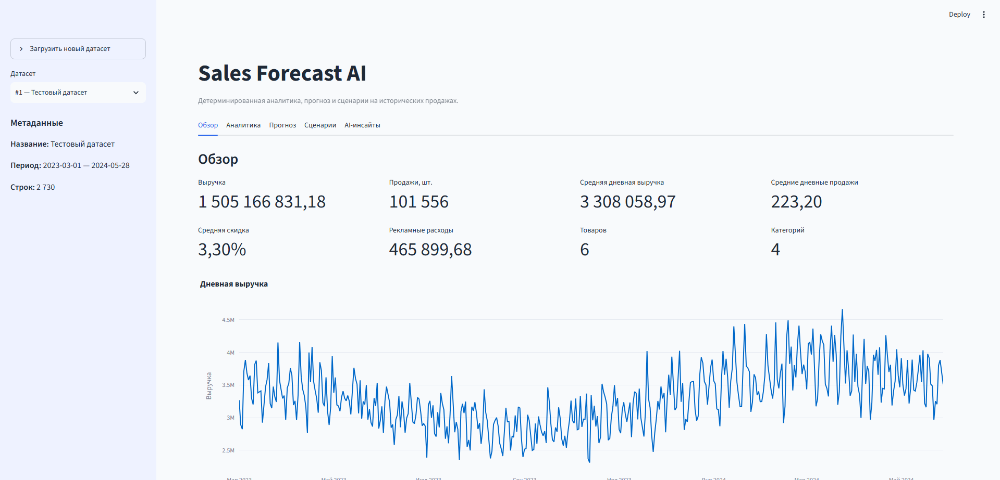
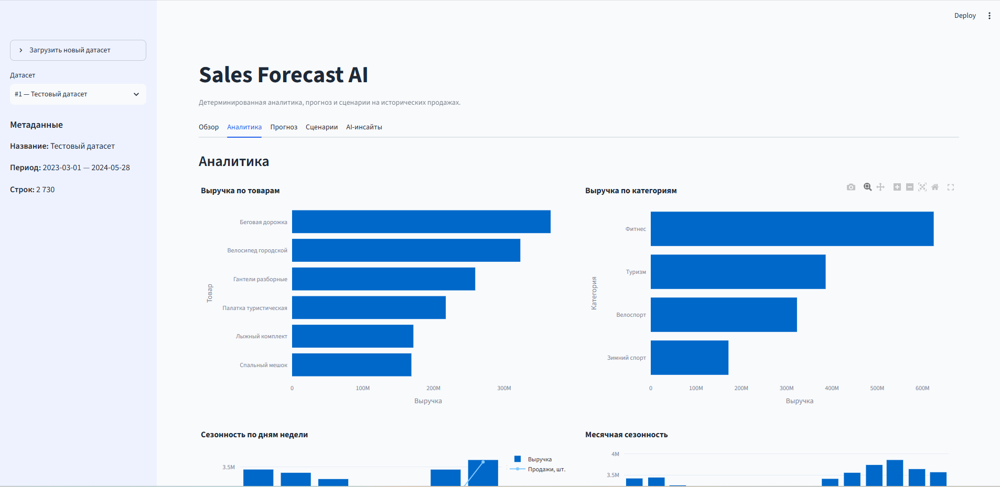
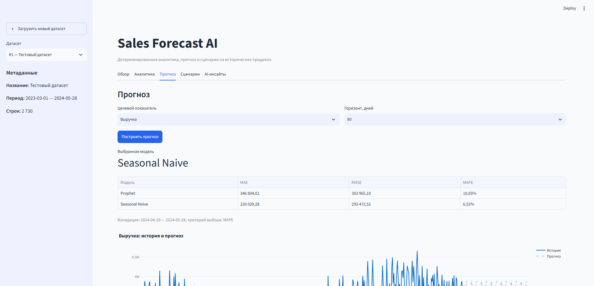
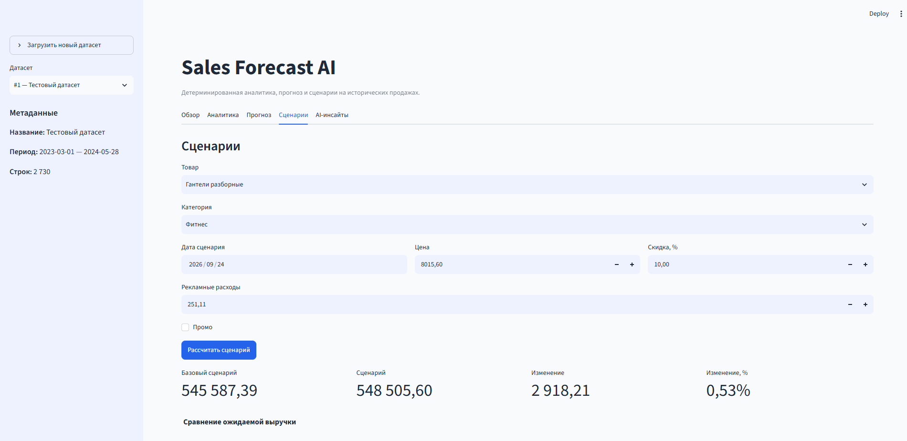
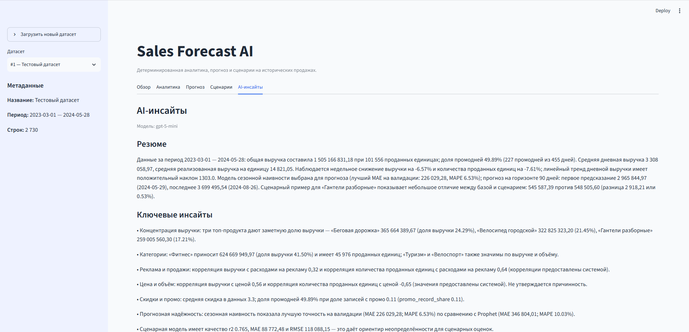
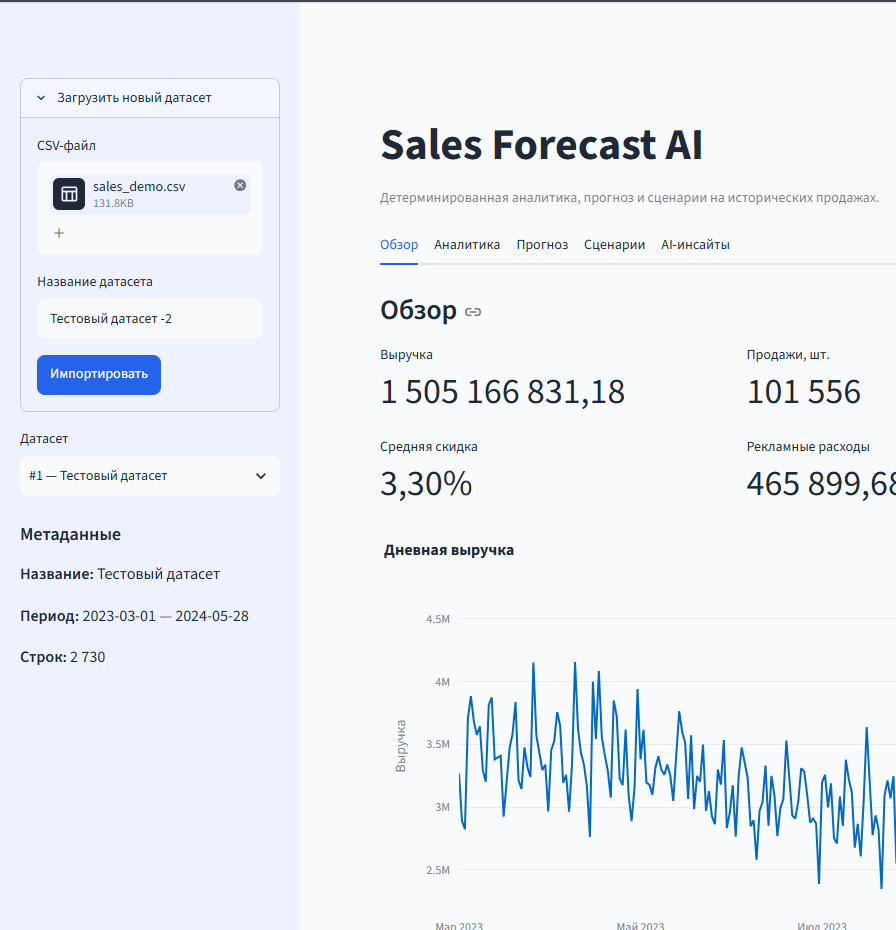

# Sales Forecast AI

AI-система для анализа исторических продаж, прогнозирования выручки и количества проданных единиц, сценарного моделирования и генерации AI-инсайтов. Приложение работает через русскоязычный Streamlit dashboard и сохраняет данные и результаты вычислений в PostgreSQL.

## Возможности

- Загрузка CSV через Streamlit dashboard.
- Валидация и нормализация входных данных.
- Сохранение датасетов и результатов в PostgreSQL.
- Описательная аналитика: KPI, динамика, тренды, сезонность и корреляции.
- Прогнозирование `revenue` и `units_sold` с Prophet и Seasonal Naive.
- Автоматический выбор прогнозной модели по результатам временной валидации.
- Сценарное моделирование выручки на базе `RandomForestRegressor`.
- Feature importance для сценарной модели.
- AI-инсайты через ProxyAPI по уже рассчитанным агрегированным результатам.
- Интерактивные Plotly-графики и русская локализация интерфейса.

## Что решает проект

Sales Forecast AI помогает работать с историей продаж без ручной сборки отдельных таблиц и расчётов: увидеть ключевые показатели, тренды и сезонность, сравнить прогнозные модели и оценить сценарий изменения факторов для конкретного товара. AI-слой интерпретирует уже рассчитанные системой результаты и формулирует осторожные выводы.

Прогноз и сценарная оценка являются статистическими оценками. Они не гарантируют будущий результат и не доказывают причинно-следственные связи.

## Архитектура

```text
Browser
  ↓
Streamlit
  ↓
Services
  ├─ Analytics
  ├─ Forecasting
  ├─ Scenario modeling
  └─ AI insights
  ↓
Repositories
  ↓
PostgreSQL
```

ProxyAPI используется только в слое AI-инсайтов. Расчёт KPI, прогнозов и сценарных оценок выполняется детерминированным Python/ML-кодом вне LLM.

```text
CSV
  ↓
Validation / normalization
  ↓
DatasetImportService
  ↓
PostgreSQL
```

## Стек

- Python 3.12
- Streamlit и Plotly
- pandas
- scikit-learn
- Prophet
- SQLAlchemy 2.x и Alembic
- PostgreSQL
- Pydantic и pydantic-settings
- OpenAI Python SDK и ProxyAPI
- Docker / Docker Compose
- pytest

## Интерфейс

### Обзор



### Аналитика



### Прогноз



### Сценарное моделирование



### AI-инсайты



## Загрузка собственного CSV



В sidebar откройте раздел «Загрузить новый датасет», выберите один CSV-файл, при необходимости укажите отображаемое имя и нажмите «Импортировать». Файл проходит существующую валидацию и нормализацию; при ошибке отображается понятное сообщение с номером строки и полем. Каждый импорт создаёт отдельный датасет — намеренная дедупликация не выполняется.

## Демонстрация

[Смотреть скринкаст](assets/Demo.mp4)

## Формат входного CSV

Все перечисленные поля обязательны. Дополнительные колонки допускаются и не используются импортным pipeline.

| Поле | Тип / формат | Назначение |
| --- | --- | --- |
| `date` | дата, например `2024-01-31` | Дата продаж |
| `product` | непустой текст | Товар |
| `category` | непустой текст | Категория товара |
| `units_sold` | целое число `>= 0` | Продажи, шт. |
| `revenue` | число `>= 0` | Выручка |
| `price` | число `> 0` | Цена товара |
| `discount_pct` | число от `0` до `100` | Скидка, % |
| `ad_spend` | число `>= 0` | Рекламные расходы |
| `promo` | boolean-подобное значение | Промо-признак |

Пустые строки игнорируются. Поля `product` и `category` очищаются от лишних пробелов, а числовые значения нормализуются до безопасных типов перед записью в БД.

## Как использовать

1. Запустите приложение.
2. Откройте [http://localhost:8501](http://localhost:8501).
3. В sidebar откройте «Загрузить новый датасет».
4. Выберите CSV.
5. Укажите имя датасета, если нужно.
6. Нажмите «Импортировать».
7. На вкладке «Обзор» запустите анализ.
8. На вкладке «Прогноз» выберите target и горизонт, затем постройте прогноз.
9. На вкладке «Сценарии» задайте пользовательский сценарий.
10. На вкладке «AI-инсайты» сгенерируйте интерпретацию результатов.

Прогнозирование, сценарная модель и AI-инсайты запускаются только явным нажатием кнопки; они не выполняются автоматически при обновлении страницы.

## Быстрый запуск

Нужны Docker и Docker Compose. Если файла `.env` ещё нет, создайте его вручную на основе `.env.example` и заполните нужные значения. Не перезаписывайте существующий `.env`.

```powershell
docker compose build app
docker compose up -d --wait postgres
docker compose run --rm --no-deps app alembic upgrade head
docker compose up -d dashboard
```

После запуска dashboard откройте [http://localhost:8501](http://localhost:8501).

## Локальная установка Python

```powershell
py -3.12 -m venv .venv
.\.venv\Scripts\Activate.ps1
pip install -e ".[dev]"
```

`pyproject.toml` — единый источник метаданных проекта, runtime-зависимостей и dev-зависимостей. Отдельный `requirements.txt` не требуется.

Для локального запуска Streamlit:

```powershell
streamlit run src/sales_forecast/ui/app.py
```

## Переменные окружения

| Переменная | Назначение |
| --- | --- |
| `DATABASE_URL` | Строка подключения к PostgreSQL. |
| `LOG_LEVEL` | Уровень стандартного Python logging. |
| `OPENAI_API_KEY` | API-ключ OpenAI-compatible ProxyAPI для AI-инсайтов. |
| `OPENAI_BASE_URL` | Базовый URL ProxyAPI. |
| `OPENAI_MODEL` | Имя модели для AI-инсайтов. |

AI-инсайты требуют OpenAI-compatible credentials для ProxyAPI. Описательная аналитика, forecasting и сценарное моделирование работают без вызова AI-слоя.

## Forecasting

Для ежедневного ряда доступны Prophet и Seasonal Naive с недельным сезонным лагом. Модели обучаются на ранней истории и проверяются на последнем временном интервале; случайное разбиение не используется, чтобы не допустить утечку будущих данных. Рассчитываются MAE, RMSE и MAPE, после чего выбирается лучшая модель. Прогноз — статистическая оценка, а не гарантия будущих продаж.

## Сценарное моделирование

Сценарная модель использует `RandomForestRegressor` для оценки выручки одной записи «товар × дата» по цене, скидке, рекламным расходам, промо, календарным признакам, товару и категории. Данные разделяются хронологически. Dashboard сравнивает базовый сценарий с пользовательским и показывает feature importance.

Важность признака и сценарная оценка отражают статистические закономерности обучающих данных; они не доказывают причинность и не определяют «оптимальную» цену, скидку или рекламный бюджет.

## AI-инсайты

LLM не рассчитывает KPI, корреляции, прогноз или сценарные предсказания. Ему передаётся только компактный структурированный payload из уже рассчитанных результатов:

```text
deterministic analytics / forecast / scenario
  ↓
compact structured payload
  ↓
ProxyAPI
  ↓
validated structured AI interpretation
```

System prompt запрещает придумывать числа и причинные утверждения. Ответ валидируется Pydantic-схемой до сохранения и отображения.

## Демо-данные

Файлы в `demo_data/` полностью синтетические и не содержат персональных данных. Они предназначены только для демонстрации и тестирования: базовый англоязычный набор, русскоязычный набор и отдельный CSV для ручной приёмки загрузки.

## Документация

- [Схема БД и SQL-проверки](docs/database.md)
- [Чек-лист перед сдачей](docs/submission-checklist.md)
- [Техническое задание](docs/Sales_Forecast_AI_TZ.docx)

## Ограничения

- Forecast не гарантирует будущие продажи.
- Scenario model не доказывает причинность.
- Качество результата зависит от качества, полноты и репрезентативности входных данных.
- Нет auth и web API.
- Нет background queue: тяжёлые операции выполняются синхронно по явной команде пользователя.
- AI-слой зависит от доступности внешнего ProxyAPI и корректных credentials.
